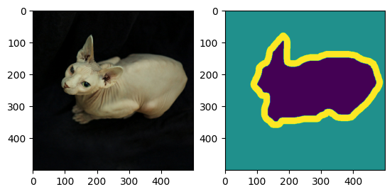
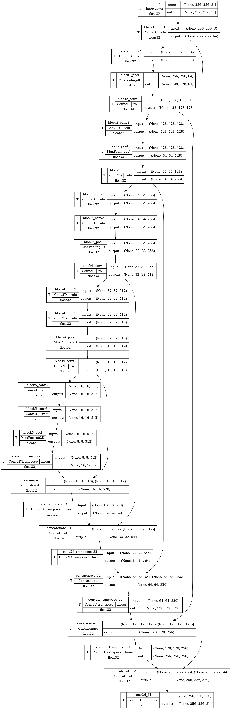
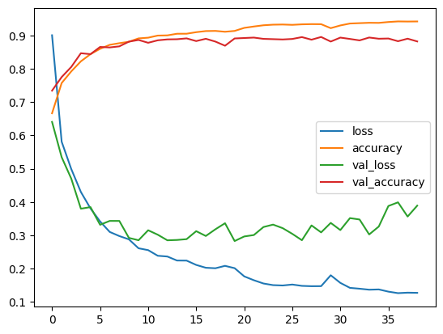
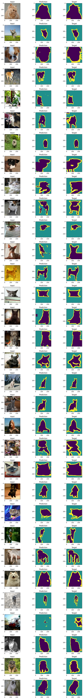

# Semantic Segmentation on Oxford-IIIT Pet

**Author:** Sevendi Eldrige Rifki Poluan  
**Date:** May 2023

This project performs pixel-wise semantic segmentation for pet images using a U-Net style architecture with a VGG16 encoder backbone. The model is trained on the Oxford-IIIT Pet dataset to classify each pixel into one of three classes: pet, border, and background.

## Project Overview

- Task: semantic segmentation
- Dataset: Oxford-IIIT Pet (from TensorFlow Datasets)
- Input image size: 256 x 256
- Batch size: 32
- Model: VGG16 encoder + U-Net style decoder
- Loss: sparse categorical crossentropy
- Optimizer: Adam
- Metric: accuracy

## Repository Structure

- semantic-segmentation-Oxford-IIIT-Pet.ipynb: end-to-end notebook (data prep, model, training, evaluation, visualization)
- Image/: exported figures from notebook outputs

## Workflow Summary

1. Load the Oxford-IIIT Pet dataset from TensorFlow Datasets.
2. Resize images and masks to 256 x 256.
3. Normalize images and remap segmentation masks to class indices.
4. Build a U-Net style model with a VGG16 backbone.
5. Train with early stopping on validation accuracy.
6. Evaluate performance and visualize predictions.

## Figures

### 1) Sample Input and Ground-Truth Mask

This figure shows an example RGB image and its target segmentation mask.

### 2) U-Net Model Architecture

Model graph generated from TensorFlow/Keras.

### 3) Training Curves

Loss and accuracy for training and validation across epochs.

### 4) Prediction Results Grid

Qualitative examples: input image, predicted mask, and target mask.

## References

1. Olaf Ronneberger, Philipp Fischer, Thomas Brox. *U-Net: Convolutional Networks for Biomedical Image Segmentation*. MICCAI 2015. arXiv:1505.04597. https://arxiv.org/abs/1505.04597
2. Karen Simonyan, Andrew Zisserman. *Very Deep Convolutional Networks for Large-Scale Image Recognition* (VGG). ICLR 2015. arXiv:1409.1556. https://arxiv.org/abs/1409.1556
3. Omkar M. Parkhi, Andrea Vedaldi, Andrew Zisserman, C. V. Jawahar. *Cats and Dogs* (Oxford-IIIT Pet Dataset). CVPR 2012. https://www.robots.ox.ac.uk/~vgg/publications/2012/parkhi12a/
4. Diederik P. Kingma, Jimmy Ba. *Adam: A Method for Stochastic Optimization*. ICLR 2015. arXiv:1412.6980. https://arxiv.org/abs/1412.6980